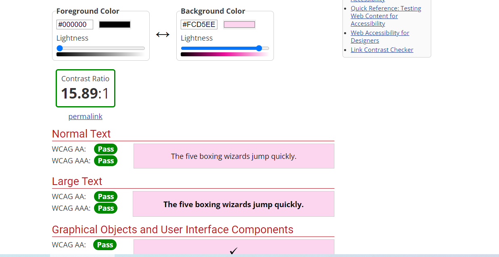
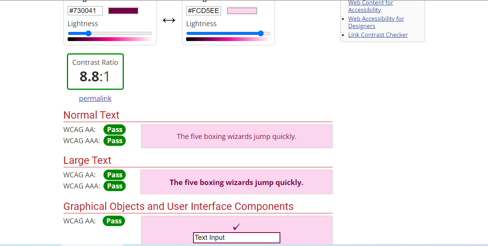
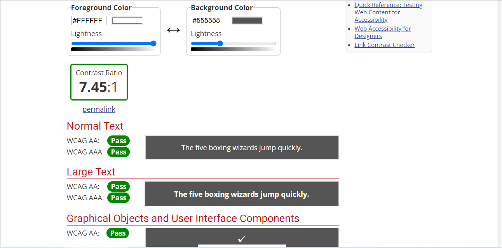
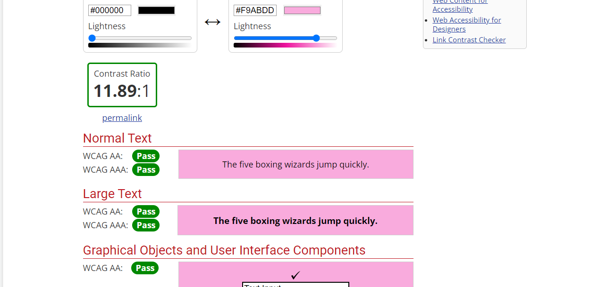
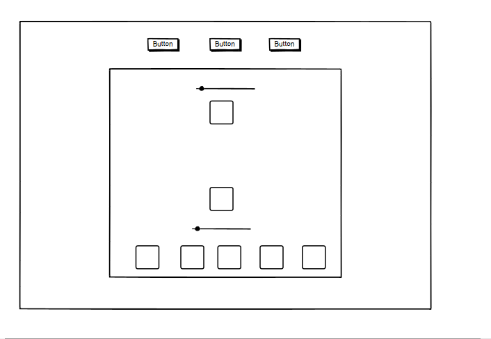

# RPSLS

Rock Paper Scissors Lizard Spock (RPSLS) is an extension of the classic game of chance, Rock Paper Scissors, created by Sam Kass and Karen Bryla. This variant was mentioned in a 2005 article in *The Times* of London and was later the subject of an episode of the American sitcom *The Big Bang Theory* in 2008.

This website is created to have fun playing this game against the computer. The game is entirely based on chance and the website is easy to navigate in order to easily find the rules, the game area and the feedback form in case the user wants to leave any comments.

Visit the deployed website [here](https:).

## Table of Contents

1. [User Experience (UX)](#user-experience-UX)
    1. [Project Goals](#project-goals)
    2. [Color Scheme](#color-scheme)
    3. [Typography](#typography)
    4. [Contrast check](#contrast-check)
    4. [Wireframes](#wireframes)
2. [Features](#features)
3. [Technologies Used](#technologies-used)
4. [Testing](#testing)
5. [Deployment](#deployment)
    1. [GitHub Pages](#github-pages)
6. [Credits](#credits)
    1. [Content](#content)
    2. [Media](#media)
    3. [Code](#code)

***

## User Experience (UX)

### Project Goals:

* The website provides a structure that is easy to understand, navigate and to interact with.

* Contains fun colors, interactivity and animations to engage the player in the game .

* Responsive design to make the site accessible on different devices.

* Incorporates a rules section that is easily accessible and understandable to the player.

* A feedback section is provided to get comments from the player in order to further develop the website.

### Color Scheme:

Colors used:
* Back-ground: linear gradient from blue (#4158D0) to  pink (#FFCC70) passing by yellow (#C850C0) in the middle. 

* Carrousel slides: A pink (rgba(240, 46, 170, 0.2) on top of a white background (#ffffff), giving a resulting color of pink (#f9abdd)

* Boxes displaying the game or text: Using a white shadow (rgba(255, 255, 255, 0.5)) on top of the Carrousel slide (#f9abdd), resulting in a color of pink (#fcd5ee).

* Retro-style buttons and links: white (#ffffff) and black (#000000)

* Table displaying the game mechanincs: Green (#0FA300) for the user and purple (#730041) for the enemy.

* Wepons selection and help pop-up button: Purple (#730041);

* Pop up backgrounds: Grey (rgba(85, 85, 85, 1) or #555555)

We used the following technologies to choose the color scheme:
* [Color palettes](https://mycolor.space/?hex=%23F6CA80&sub=1): Use to find colors that would match
* [Eye dropper](https://eyedropper.org/): Used to pick color from other sources.

### Contrast check:

We used [WebAIM](https://webaim.org/resources/contrastchecker/) to check accesability, as shown below.

Contrast between black text and light pink boxes:
  

Contrast between purple weapon selection and and pink background:
  

Contrast between pop-up text and background:
   

Contrast between black welcome text and pink background:
    

### Typography:

The font used in the site is Teko, with Sans Serif as the fallback font in case Teko is not being imported correctly.

### Wireframes:

[Balsamiq](https://balsamiq.com/) has been used to showcase the appearance of the site and display the placement of the different elements whitin the pages.

Here we can see an example of the game section wireframe:

[Back to top ⇧](#rpsls)