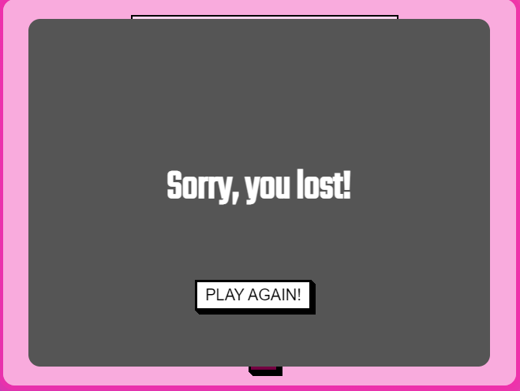

# RPSLS

Rock Paper Scissors Lizard Spock (RPSLS) is an extension of the classic game of chance, Rock Paper Scissors, created by Sam Kass and Karen Bryla. This variant was mentioned in a 2005 article in *The Times* of London and was later the subject of an episode of the American sitcom *The Big Bang Theory* in 2008.

This website is created to have fun playing this game against the computer. The game is entirely based on chance and the website is easy to navigate in order to easily find the rules, the game area and the feedback form in case the user wants to leave any comments.

Visit the deployed website [here](https:).

## Table of Contents

1. [User Experience (UX)](#user-experience-UX)
    1. [Project Goals](#project-goals)
    2. [Color Scheme](#color-scheme)
    3. [Typography](#typography)
    4. [Contrast check](#contrast-check)
    4. [Wireframes](#wireframes)
2. [Features](#features)
3. [Technologies Used](#technologies-used)
4. [Testing](#testing)
5. [Deployment](#deployment)
    1. [GitHub Pages](#github-pages)
6. [Credits](#credits)
    1. [Content](#content)
    2. [Media](#media)
    3. [Code](#code)

***

## User Experience (UX)

### Project Goals:

* The website provides a structure that is easy to understand, navigate and to interact with.

* Contains fun colors, interactivity and animations to engage the player in the game .

* Responsive design to make the site accessible on different devices.

* Incorporates a rules section that is easily accessible and understandable to the player.

* A feedback section is provided to get comments from the player in order to further develop the website.

### Color Scheme:

Colors used:
* Back-ground: linear gradient from blue (#4158D0) to  pink (#FFCC70) passing by yellow (#C850C0) in the middle. 

* Carrousel slides: A pink (rgba(240, 46, 170, 0.2) on top of a white background (#ffffff), giving a resulting color of pink (#f9abdd)

* Boxes displaying the game or text: Using a white shadow (rgba(255, 255, 255, 0.5)) on top of the Carrousel slide (#f9abdd), resulting in a color of pink (#fcd5ee).

* Retro-style buttons and links: white (#ffffff) and black (#000000)

* Table displaying the game mechanincs: Green (#0FA300) for the user and purple (#730041) for the enemy.

* Wepons selection and help pop-up button: Purple (#730041);

* Pop up backgrounds: Grey (rgba(85, 85, 85, 1) or #555555)

We used the following technologies to choose the color scheme:
* [Color palettes](https://mycolor.space/?hex=%23F6CA80&sub=1): Use to find colors that would match
* [Eye dropper](https://eyedropper.org/): Used to pick color from other sources.

### Contrast check:

We used [WebAIM](https://webaim.org/resources/contrastchecker/) to check accesability, as shown below.

Contrast between black text and light pink boxes:
  

Contrast between purple weapon selection and and pink background:
  

Contrast between pop-up text and background:
   

Contrast between black welcome text and pink background:
    

### Typography:

The font used in the site is Teko, with Sans Serif as the fallback font in case Teko is not being imported correctly.

### Wireframes:

[Balsamiq](https://balsamiq.com/) has been used to showcase the appearance of the site and display the placement of the different elements whitin the pages.

Here we can see an example of the game section wireframe:

[Back to top ⇧](#rpsls)

## Features

### Header
* A navigation bar is placed at the center of the header. Each button has an active effect that gives the sensation of an 3D button being pushed when clicked.
* Each button directs you to the corresponding section

Header screenshot normal:

  

Header screenshot active:

  

### Footer

* Social media links (for facebook, instagram and Twitter) are placed at the bottom of the page. All the links will open in a new tab. 
Footer screenshot:

 

### Main section

### Instructions section

* A section that introduces the game to the user, presenting the different weapons available (rock, paper, scissor, lizzard, spock) for the battle and number of rounds. 

* Shows a table with all the possible battle outcomes.

Instruction section screenshot:

### Game section

* Contains two marked areas that represent the weapon selection and health status of the user and the enemy.

* A central and neutral territory that explains the outcome of each round

* Five buttons permitting the user choose between the 5 weapons available 

* A buttons with an "?" which displays a pop-up with an image showing who beats who.

Game section screenshot:

### Help pop-up

* Contains image displaying advantages and disadvantages of each wepon.

* "Close" button making the pop-up dissapear.

Help pop-up screenshot:

### Winning or loosing pop-up

* A pop-up displays the result of the battle once the user or the enemy have no more health

* The style of both pop-up is the same, with the animations being different

Result pop-up screenshots:

### Feedback section

* Contains a form permitting the users to suggest further developments

* Incorporates a simple radio input which permits user to rate their expirience from 1 to 5.

* To submit the form, all fields are requiered.

* When submitted, the submision form opens on a new tab

Feedback section screenshot:

Form submission screenshot:

# 3. Technologies used

* [HTML5](https://en.wikipedia.org/wiki/HTML5) was used for structuring and presenting content of the website.
* [CSS3](https://en.wikipedia.org/wiki/CSS) was used to provide the style to the content written in a HTML.
* [javaScript](https://en.wikipedia.org/wiki/JavaScript) was used to provide the logic of the game and help with animations.
* [Balsamiq](https://balsamiq.com/) was used to create wireframes of the website (desktop and mobile version).
* [Google Fonts](https://fonts.google.com/) was used to import font-family "Lato" and "Oswald" into style,css file and which was used throughout the pages of the website.
* [Font Awesome](https://fontawesome.com/) was used to improt icons to the sites.
* [Chrome](https://www.google.com/intl/en_uk/chrome/) was used to debug and test the source code.
* [Gitpod](https://www.gitpod.io/) was used as the Code Editor for the site
* [Github](https://github.com/) was used to create the repository.
* [W3C Markup](https://validator.w3.org/) and [Jigsaw validation](https://jigsaw.w3.org/) tools were used to validate the HTML code and CSS code.
* [Ami](http://ami.responsivedesign.is/#) was used to develop a Mockup screenshot generator

  
## 4. Testing
  
### 4.1 Testing using tools

* Google Developer Tools: Google developer tools (Chrome DevTools) was used as debugging tool. The code was inspected modified here, before changing the source code.

* [Am I Responsive](http://ami.responsivedesign.is/):site was used to check the responsiveness of the web page

* [W3C Markup](https://validator.w3.org/#validate_by_input+with_options) was used to check for any errors within the HTML pages. Two errors where found that were subsequently fixed.

Index page html validation screenshot:
  

[W3C CSS Validation](https://jigsaw.w3.org/css-validator/) was used to check for any error within the CSS stylesheet. No errors were found.

Css style sheet validation screenshot:
  

[JSHints JavaScript Code Quality Tool](https://jigsaw.w3.org/css-validator/) was used to check for any error within the CSS stylesheet. As seen in the sreencshot, multiple errors were found, subsequently fixed

Css style sheet validation screenshot:
  
