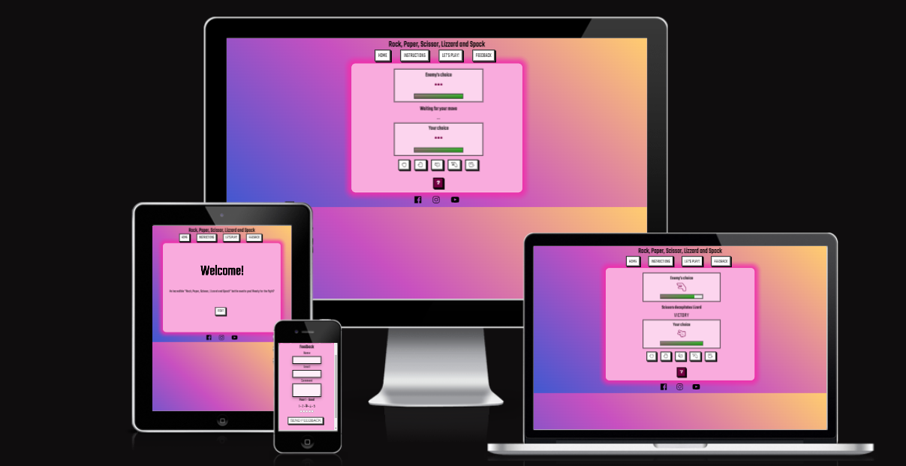
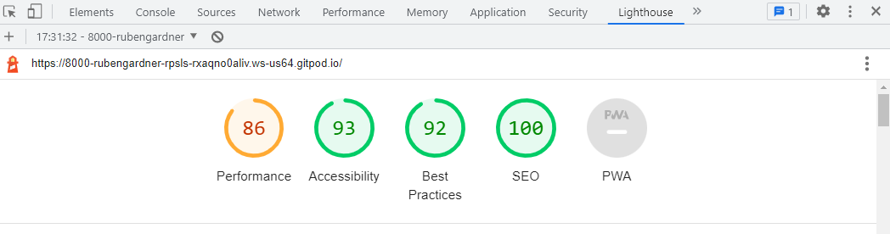

# Rock, paper, scissor, lizard and Spock game

Rock Paper Scissors Lizard Spock (RPSLS) is an extension of the classic game of chance, Rock Paper Scissors, created by Sam Kass and Karen Bryla. This variant was mentioned in a 2005 article in *The Times* of London and was later the subject of an episode of the American sitcom *The Big Bang Theory* in 2008.

This website is created to have fun playing this game against the computer. The game is entirely based on chance and the website is easy to navigate in order to easily find the rules, the game area and the feedback form in case the user wants to leave any comments.

Visit the deployed website [here](https://rubengardner.github.io/rpsls/).

## Table of Contents

1. [User Experience ](#user-experience)
2. [Features](#features)
3. [Technologies Used](#technologies-used)
4. [Testing](#testing)
5. [Bugs](#bugs)
6. [Deployment](#deployment)
7. [Credits](#credits)

***

## User Experience

### Project Goals:

* The website provides a structure that is easy to understand, navigate and interact with.

* Contains fun colours, interactivity and animations to engage the player in the game.

* Responsive design to make the site accessible on different devices.

* Incorporates a rules section that is easily accessible and understandable to the player.

* A feedback section is provided to get comments from the player in order to further develop the website.

### Color Scheme:

Colours used:
* Background: linear gradient from blue (#4158D0) to  pink (#FFCC70) passing by yellow (#C850C0) in the middle. 

* Carrousel slides: A pink (rgba(240, 46, 170, 0.2) on top of a white background (#ffffff), giving a resulting color of pink (#f9abdd)

* Boxes displaying the game or text: Using a white shadow (rgba(255, 255, 255, 0.5)) on top of the Carrousel slide (#f9abdd), resulting in a color of pink (#fcd5ee).

* Retro-style buttons and links: white (#ffffff) and black (#000000)

* Table displaying the game mechanics: Green (#0FA300) for the user and purple (#730041) for the enemy.

* Weapons selection and help pop-up button: Purple (#730041);

* Pop up backgrounds: Grey (rgba(85, 85, 85, 1) or #555555)

We used the following technologies to choose the colour scheme:
* [Color palettes](https://mycolor.space/?hex=%23F6CA80&sub=1): Use to find colours that would match
* [Eye dropper](https://eyedropper.org/): Used to pick colours from other sources.

### Contrast check:

We used [WebAIM](https://webaim.org/resources/contrastchecker/) to check accessibility, as shown below.

The contrast between black text and light pink boxes:
  

The contrast between purple weapon selection and pink background:
  

The contrast between pop-up text and background:
   

The contrast between black welcome text and pink background:
    

### Typography:

The font used in the site is Teko, with Sans Serif as the fallback font in case Teko is not being imported correctly.

### Wireframes:

[Balsamiq](https://balsamiq.com/) has been used to showcase the appearance of the site and display the placement of the different elements within the pages.

Here we can see an example of the game section wireframe:

## Features

### Header
* A navigation bar is placed at the centre of the header. Each button has an active effect that gives the sensation of a 3D button being pushed when clicked.
* Each button directs you to the corresponding section

Header screenshot normal:

  

Header screenshot active:

  

### Footer

* Social media links (for Facebook, Instagram and Twitter) are placed at the bottom of the page. All the links will open in a new tab. 
Footer screenshot:

 

### Main section

* A section that welcomes the user and directs him to the game area.

### Instructions section

* A section that introduces the game to the user, presenting the different weapons available (rock, paper, scissor, lizard, Spock) for the battle and the number of rounds. 

* Shows a table with all the possible battle outcomes.

Instruction section screenshot:

### Game section

* Contains two marked areas that represent the weapon selection and health status of the user and the enemy.

* A central and neutral territory that explains the outcome of each round

* Five buttons permitting the user to choose between the 5 weapons available 

* A button with an "?" displays a pop-up with an image showing who beats who.

Game section screenshot:

### Help pop-up

* Contains image displaying advantages and disadvantages of each weapon.

* "Close" button making the pop-up disappear.

Help pop-up screenshot:

### Winning or losing pop-up

* A pop-up displays the result of the battle once the user or the enemy have no more health.

* The style of both pop-ups is the same, with the animations being different.

Result pop-up screenshots:

### Feedback section

* Contains a form permitting the users to suggest further developments

* Incorporates a simple radio input which permits the user to rate their experience from 1 to 5.

* To submit the form, all fields are required.

* When submitted, the submission form opens on a new tab

Feedback section screenshot:

Form submission screenshot:

## Technologies used

* [HTML5](https://en.wikipedia.org/wiki/HTML5) was used for structuring and presenting the content of the website.
* [CSS3](https://en.wikipedia.org/wiki/CSS) was used to provide the style to the content written in HTML.
* [JavaScript](https://en.wikipedia.org/wiki/JavaScript) was used to provide the logic of the game and help with animations.
* [Balsamiq](https://balsamiq.com/) was used to create wireframes of the website.
* [Google Fonts](https://fonts.google.com/) was used to import font-family "Teko".
* [Font Awesome](https://fontawesome.com/) was used to import icons to the sites.
* [Chrome](https://www.google.com/intl/en_uk/chrome/) was used to debug and test the source code.
* [Gitpod](https://www.gitpod.io/) was used as the Code Editor for the site
* [Github](https://github.com/) was used to create the repository.
* [W3C Markup](https://validator.w3.org/) and [Jigsaw validation](https://jigsaw.w3.org/) tools were used to validate the HTML code and CSS code.
* [Ami](http://ami.responsivedesign.is/#) was used to develop a Mockup screenshot generator

  
## Testing
  
### Testing using tools

* Google Developer Tools: Google developer tools (Chrome DevTools) were used as debugging tool. The code was inspected and modified here, before changing the source code.

* [Am I Responsive](http://ami.responsivedesign.is/): site was used to check the responsiveness of the web page

* [W3C Markup](https://validator.w3.org/#validate_by_input+with_options) was used to check for any errors within the HTML pages. Two errors were found that were subsequently fixed.

Index page Html validation screenshot:
  

[W3C CSS Validation](https://jigsaw.w3.org/css-validator/) was used to check for any error within the CSS stylesheet. No errors were found.

CSS style sheet validation screenshot:
  

[JSHints JavaScript Code Quality Tool](https://jshint.com/) was used to check for any error within the CSS stylesheet. As seen in the sreenshot, multiple errors were found. 

JavaScript style sheet validation screenshot:
  

  Some errors couldn't be fixed because the functionality of the web page depends on them. These errors are shown below. 

JavaScript style sheet validation screenshot:
  

Accessibility	of the page was tested using lighthouse (chrome developer tools)

Lighthouse validation screenshot:
 

## Manual testing

### Main

TEST            | OUTCOME                          | PASS / FAIL  
--------------- | -------------------------------- | ---------------
Home button | on clicking  "home", the browser redirects me to the introduction section .| PASS
Instructions button|  on clicking  "Instructions", the browser redirects me to the instructions section. | PASS
Let's play button|  on clicking  "let's play", the browser redirects me to the game section. | PASS
Feedback button|  on clicking  "booking", the browser redirects me to the feedback section. | PASS
Responsive | All elements were responsive (mobile and website) using different breakpoints.| PASS
Foreground & background  color| Checked foreground information is not distracted by backgrounds| PASS
Text|Checked if all fonts and colours used are consistent or not|PASS
Accessibility | Checked the accessibility of the page using lighthouse| PASS
Media| All images and videos on the pages load and play. All images were checked if they blurred in different screen sizes| PASS

### Footer
TEST            | OUTCOME                          | PASS / FAIL  
--------------- | -------------------------------- | ---------------
Facebook | on clicking the Facebook icon, a new tab opens and redirects to the Facebook website.| PASS
Twitter | on clicking the Linkedin icon, a new tab opens and redirects to the Twitter website.  | PASS
Instagram | on clicking the Instagram icon, a new tab opens and redirects to the instagram website.  | PASS

### Game section
TEST            | OUTCOME                          | PASS / FAIL  
--------------- | -------------------------------- | ---------------
Game buttons| All weapon buttons on clicked select the correct weapon and initiate correctly the game mechanics| PASS
Animations | Animations display correctly on the user and on the enemy when they lose the round.| PASS
Health bar | Loose health in time steps when the user or the enemy lose the round| PASS
Rapid fire | Rapid fire of the game mechanics is not permitted| PASS
Result pop-up| When one of the players ends without health, a pop-up showing the result appears| PASS
Help pop-up | On clicking the '?' sign, a pop-up appears| PASS
Closing pop-ups | All pop-ups have closing buttons that work| PASS

### Feedback section
TEST            | OUTCOME                          | PASS / FAIL  
--------------- | -------------------------------- | ---------------
Submit| Checked if submit button works and opens on another tab |PASS

## Bugs

* A rapid-fire bug was encountered:
The control loop that checked if the player had lost would not be called if the user did "Rapid fire" and clicked the game buttons faster than the time the health bar took to refresh. 

It was fixed by adding a global variable that would disable the game buttons after clicking them for one second.

## Deployment

The site was deployed to GitHub pages using the following steps:
- Sign up to GitHub
- Create a new repository on GitHub.
- Click on settings on the navigation bar under the repository title.
- Select pages on the left menu bar.
- Click on the main branch and save.
- This will generate a link to your live website.
- The live link can be found here - (https://rubengardner.github.io/rpsls/)

## Credits

### Code
* The fonts used in this website came from [Google fonts](https://fonts.google.com/about)
* The footer code came from the Love Running projects
* The icons in the footer, instructions sections and game sections came from [Font Awesome](https://fontawesome.com/)
* The progress bar code representing the health bar came from [CSS Tricks](https://css-tricks.com/html5-progress-element/)
* The code for making the health bar loose heath in time steps was taken from stack overflow [Stack Overflow](https://stackoverflow.com/questions/2956966/javascript-telling-setinterval-to-only-fire-x-amount-of-times)

### Content 

* The  images on the help button pop-up was taken from Big Bang Theory fan website  [Big bang theory fandom](https://bigbangtheory.fandom.com/wiki/Rock,_Paper,_Scissors,_Lizard,_Spock)
* The testing content was taken from [dhakal79 project 1 portofolio](https://github.com/dhakal79/Portfolio-project-MS1/blob/master/README.md).

